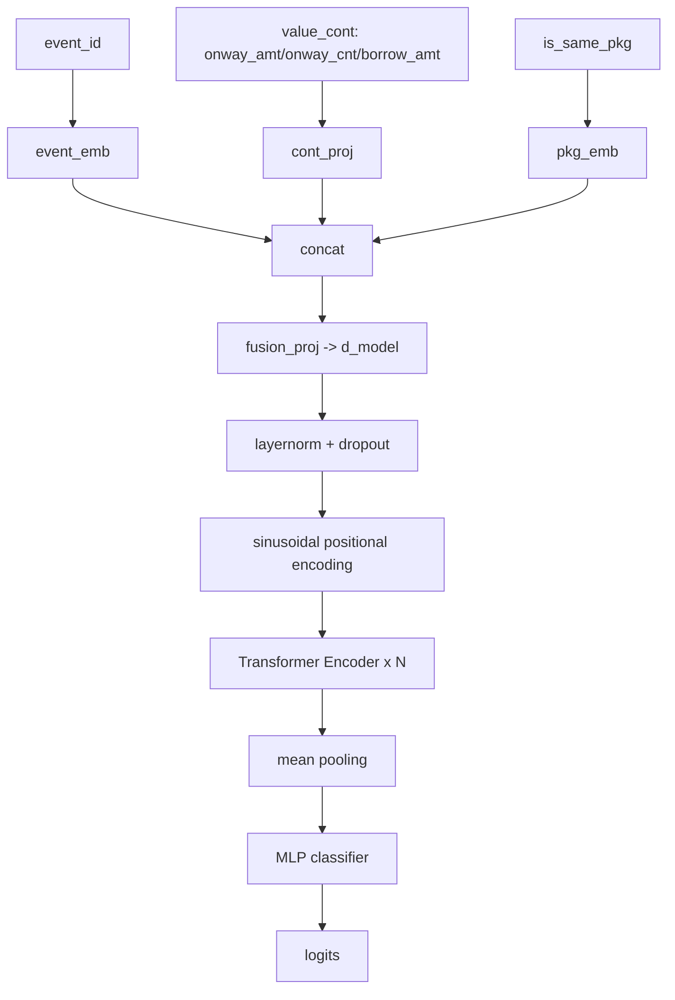

# 网络结构示意（event + pos + value-dims）

```mermaid
flowchart TD
    A[event_id] --> B[event_emb]
    C[value_cont: onway_amt/onway_cnt/borrow_amt] --> D[cont_proj]
    E[is_same_pkg] --> F[pkg_emb]

    B --> G[concat]
    D --> G
    F --> G
    G --> H[fusion_proj -> d_model]
    H --> I[layernorm + dropout]
    I --> J[sinusoidal positional encoding]
    J --> K[Transformer Encoder x N]
    K --> L[mean pooling]
    L --> M[MLP classifier]
    M --> N[logits]
```

## 输入特征

- 使用：`event_id`、`cont_values`、`is_same_pkg`
- 不使用：`time_delta`
