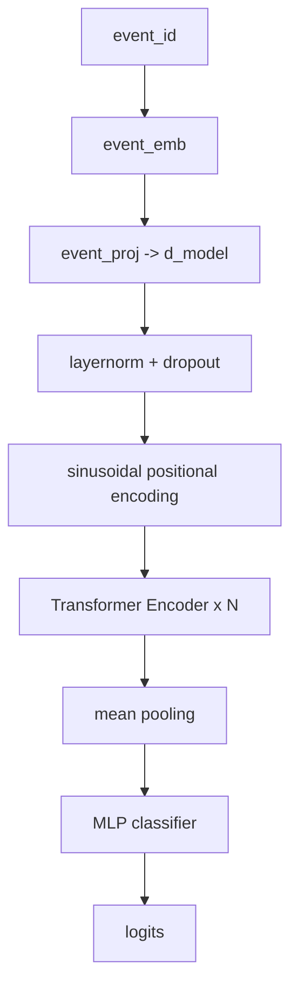

# 网络结构示意（event + sinusoidal-pos）

```mermaid
flowchart TD
    A[event_id] --> B[event_emb]
    B --> C[event_proj -> d_model]
    C --> D[layernorm + dropout]
    D --> E[sinusoidal positional encoding]
    E --> F[Transformer Encoder x N]
    F --> G[mean pooling]
    G --> H[MLP classifier]
    H --> I[logits]
```

## 输入特征

- 使用：`event_id` + 正弦位置编码
- 不使用：`time_delta`、`cont_values`、`is_same_pkg`
