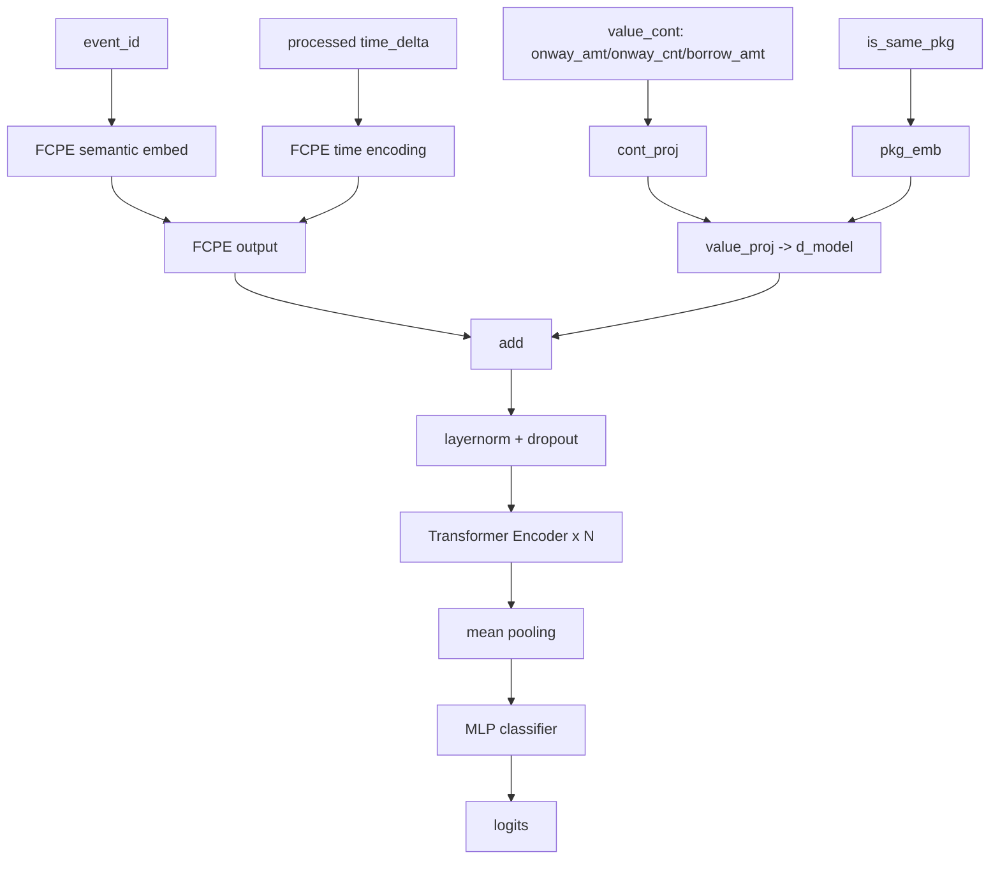

# 网络结构示意（event + FCPE + value-dims）

```mermaid
flowchart TD
    A[event_id] --> B[FCPE semantic embed]
    T[processed time_delta] --> C[FCPE time encoding]
    B --> D[FCPE output]
    C --> D

    E[value_cont: onway_amt/onway_cnt/borrow_amt] --> F[cont_proj]
    G[is_same_pkg] --> H[pkg_emb]
    F --> I[value_proj -> d_model]
    H --> I

    D --> J[add]
    I --> J
    J --> K[layernorm + dropout]
    K --> L[Transformer Encoder x N]
    L --> M[mean pooling]
    M --> N[MLP classifier]
    N --> O[logits]
```

## 输入特征

- 使用：`event_id`、`time_delta`（处理后）、`cont_values`、`is_same_pkg`
- 位置建模：由 FCPE 负责（替代正弦位置编码）
