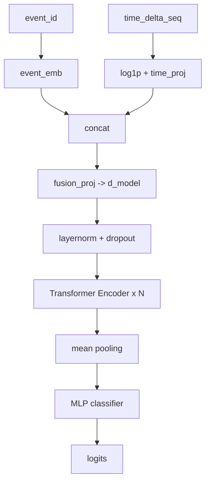

# 网络结构示意（event + processed-time）

```mermaid
flowchart TD
    A[event_id] --> B[event_emb]
    C[time_delta_seq] --> D[log1p + time_proj]

    B --> E[concat]
    D --> E
    E --> F[fusion_proj -> d_model]
    F --> G[layernorm + dropout]
    G --> H[Transformer Encoder x N]
    H --> I[mean pooling]
    I --> J[MLP classifier]
    J --> K[logits]
```

## 输入特征

- 使用：`event_id`、`time_delta`（处理后）
- 不使用：`cont_values`、`is_same_pkg`
